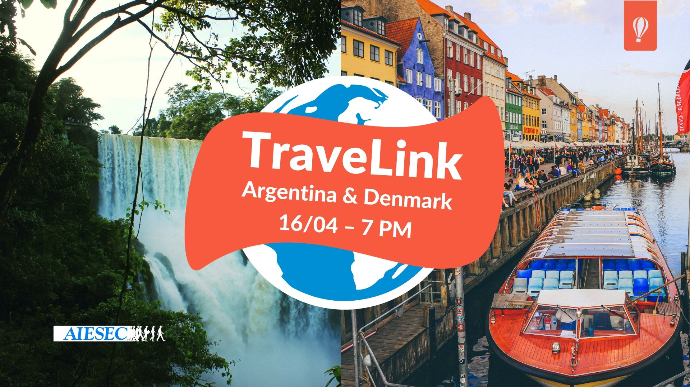
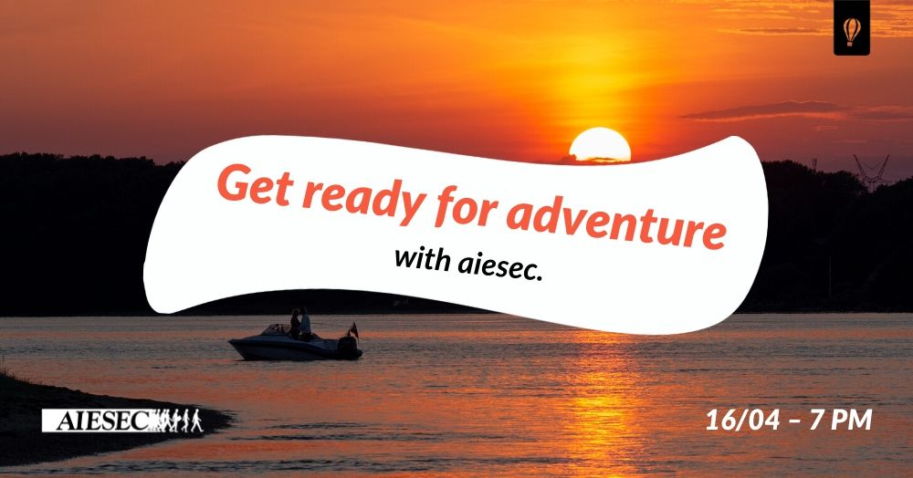
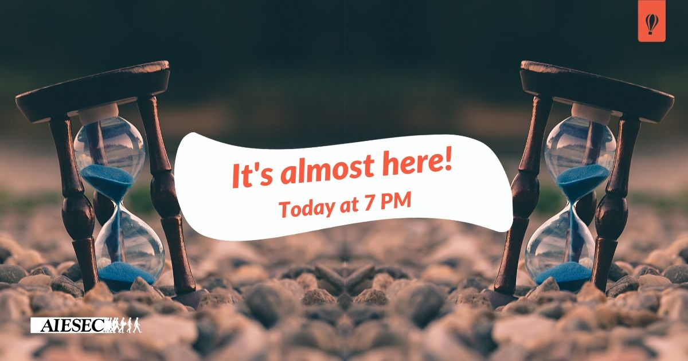
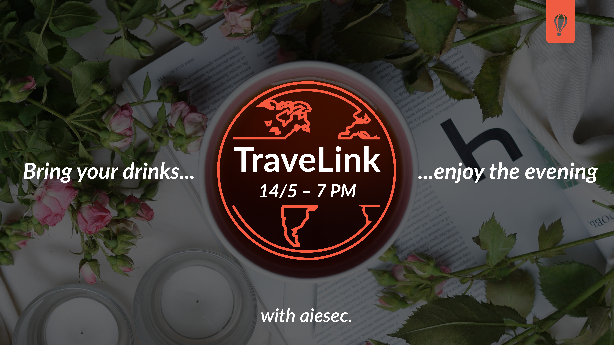
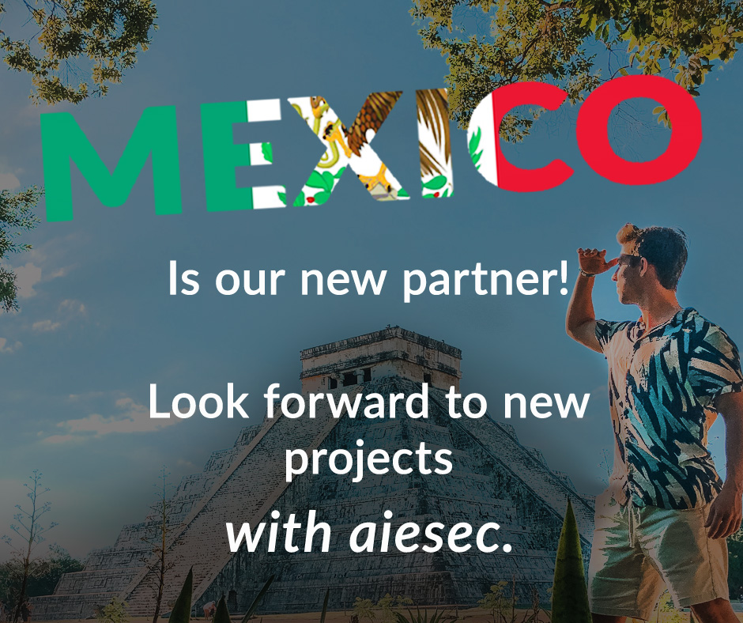

# **Aiesec Journey**

## **First term**

### Rough start

I joined AIESEC as a newbie in March 2020. AIESEC is the largest
non-profit student organization established in 1948. We create
opportunities for young people around the world. We offer experience
through international internships or volunteering jobs for students.
AIESEC has many local committees in many countries (10 in Czech
Republic) and offers different work positions like marketing, sales,
finance or talent management and you can also move up the ladder to
become team leader, vice-president and so on. I was allocated to the
attraction team for one of the products called Global Volunteer that
AIESEC offers. But there was one problem that none of us could expect –
Covid-19. Due to closing of the borders and people turning away from
traveling, especially for a longer period, we could not do promotion for
international exchanges.

### TraveLink I

AIESEC, except doing exchanges, also focuses on organizing different
types of events for students. One of those is a “Travel Evening” event
where two people share their stories from their volunteering experience.
Our team leader wanted us to figure out a new name for this event that
will be held online for the first time. I was thinking for a while and
came up with **TraveLink - Travel + Link.** I was also responsible for
creating all the material for promoting it including many posts and
event cover. The name was also approved by Members Committee for Czech
Republic which is a team directing all 10 local committees in the
country and will be used from now on by all of them for similar online
events.

**Event cover:**

**Event posts:**

    

### TraveLink II

Shortly after first TraveLink we organized a second one. I got more free
hand and I created a better visual than the first time. I prepared the
new logo, I used the new campaign called **“with aiesec.”** and it worked
pretty nicely. It is supposed to be used in the sentence and it helped
me to create quotes for the posts. This TraveLink was so far most
successful in terms of attendance, even better than the offline Travel
Evenings.

**Event cover:**

**Event posts:**

    

### End of term and Gala night

At the end of June we had Gala night to celebrate the term and there was
an awards ceremony.It was a very nice moment because our team won an
award for most successful team in this term.

Because I want to continue to improve my skills I decided to apply for a
higher position. I wanted to become either Team Leader of Attraction or
Manager of Marketing which is quite a similar position. Difference is
that as manager you don’t have any new members to take care of but you
have more responsibilities and make more decisions. At first I was
elected as Team Leader of Attraction but due to the bad term for AIESEC
and loss of some members the leaders of our committee decided to merge
attraction and marketing. So I transitioned to Manager of Marketing for
this term. So far I made a few promotional posts and I was also in the
team taking care of one big event on VŠE.

**Product posts:**
   
 
 

### Prvákoviny VŠE 2020

This is so far my biggest contribution in AIESEC. I was The person responsible for the whole marketing process of this
event. I created a timeline for posting and for promotion and all the
graphic materials. This event is organized for freshmen at the
University of Economics in Prague in September and it is 3 days long.
This year it was supposed to be mostly online with one day at the
university, but in the end we had to do it all online. First two days
were all about online student clubs at university. It is also part of
AIESEC recruitment process for new members. The work took about 2 months
and it was a great team work experience and decision making process in
which I gained a lot of experience. We had more than 200 registrations,
more than 70 attendees and we got about 15 applications for our
committee.

**Logo**

**Event cover:**

**Agenda posts:**

    

**Workshop posts:**

  

**Reminder posts:**

## **Second term**

### Plan B

Even though we are a non-profit organization we still need to earn money
to pay for our offices and other expenses but due to uncertain future
and restrictions we can no longer focus only on exchanges. We are
currently working on a new set of events which are gonna be based on
cooperation with companies. As a Manager of Marketing I will be of
course responsible for the promotion of the event and we are already
working on it. We will create workshops with companies for students and
we called this project **Headstart**.

### Elected board application

Right now I’m in the process of becoming part of the leading team of our
committee for the next year and possibly becoming vice-president of
marketing. This means I will also become part of commision and
communicate with Members Committee and other local committees in Czech
Republic and I will be taking care of delegating work and leading my
functional area.
