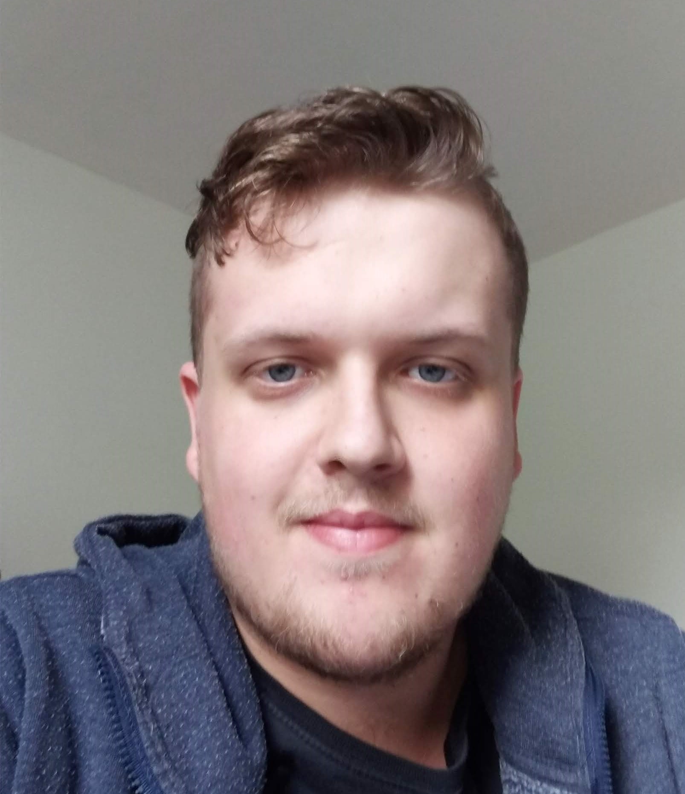
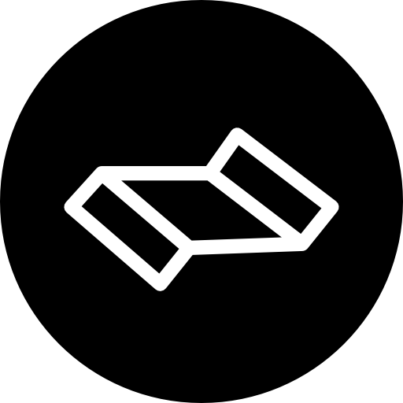
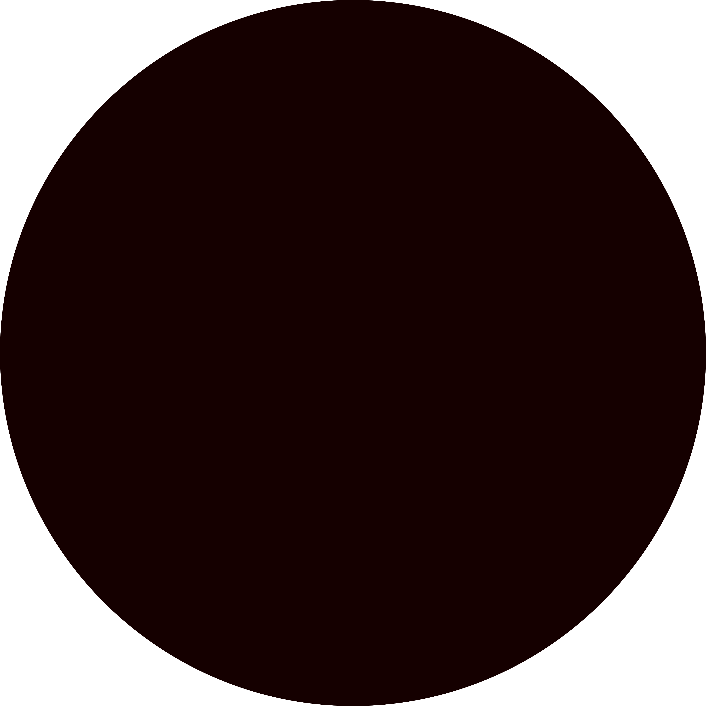
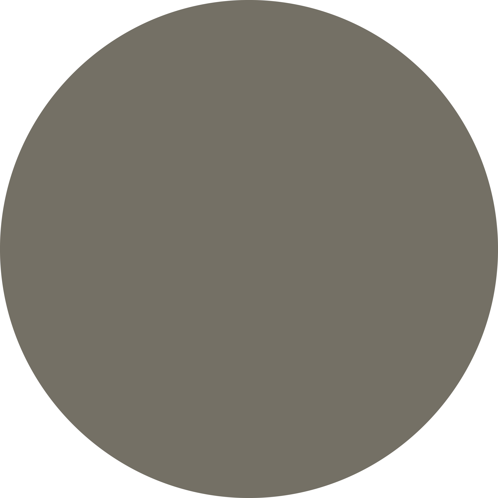
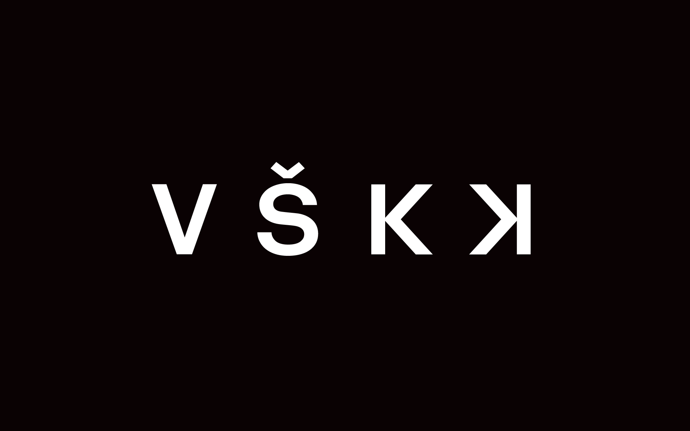
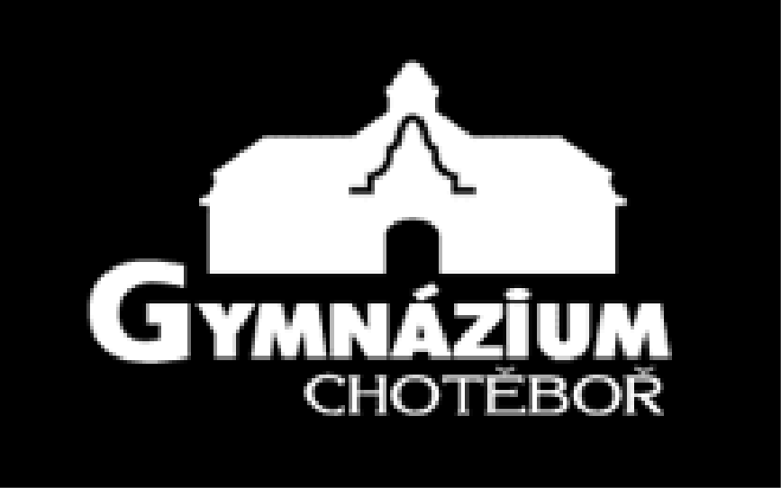

# MATĚJ LEHER 

### *I'm Graphic Designer*
-----------------
## CONTACT ME

 +420 734 684 043 

 matej.leher@seznam.cz

 Bílek 112, Chotěboř 583 01, Czech Republic

---------------------
## MY INTERESTS

### Design
In design I look for ***new art styles*** that are enabled by new technology and software tools. I also focus on ***digital design*** because it's challenging and complex work. Then I'm very interested in ***character and game design*** because it is not only about creating nice visual but also personality, mechanics, stories and so on.
### Fantasy/Sci–fi
I grew up on fantasy books, tv shows and games. I think it is also empowering my creativity and thinking outside of the box. That is why I like ***gaming, reading, board games, movies and tv shows*** with something more than you see in real life.
### Drawing
Drawing is definitely part of my life and my work. Usualy when I'm listening something and I get bored and have a piece of paper I start to sketch.
### Cycling
Ii is my favorite exercise activity, because you can observe and also you are not staying in one place.

---------------------

## LANGUAGES

### Czech – Native     |      English – B2       |       German – A2
###              **|**              **|**             

----------------------
## WORK EXPERIENCE
### AIESEC PRAGUE  
**2020–present**

I was working on creating promotional materials for online events and I was also responsible for promoting it on social media.
I was promoted to position of marketing manager. In August and September I was part of a team creating bigger online event for University of Economics, Prague and I created logo and all promotional materials. I also did few presentations and sessions about marketing and design. Now I've been elected as vice-president of marketing functional area for next year.

### AMNESTY INTERNATIONAL IN CHOTĚBOŘ 

**2015–2018**

I was member of Amnesty International club in Gymnázioum Chotěboř and it was my extracurricular activity in highschool.
We were preparing some events for local people and students. i was part of organization team and created posters for them, and I also had few presentations myself.

---------------
## MY SKILLS
I feel strong in branstorming, team work, cooperation, creativity, concept creation
I am used  to work with Adobe CC, I focus on logo design, digital design and social media marketing

-----------
## EDUCATION
### UNIVERSITY OF CREATIVE COMMUNICATION (VŠKK) 
**GRAPHIC AND MEDIA DESIGN**

**2018–2020**

### GYMNÁZIUM CHOTĚBOŘ 

**GRAMMAR SCHOOL**

**2016-2018**

------------------
## MY CERTIFICATES

### CIRKULÁTOR – 24KA | *2019*

**1ST PLACE** | MARKETING COMPETITION AWARD

### FCE – FIRST CERTIFICATE IN ENGLISH | *2018*

LEVEL B2

-----------------
