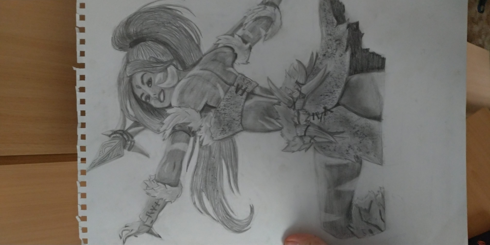
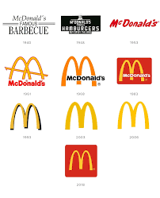
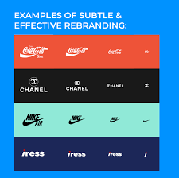

# VI Copying
------------
**If I'd have to summarize my opinion in one sentence I would say this:**
If your are going to do exact copy of sombody elses work or ideas I consider it ok if you use it for your personal use, however if you straight up copy and use it as professional work and get paid for it I wouldn't consider you as professional. 

## Copying as a way to learn or appreciate the work
I see copying as a way to learn from experienced professionals. Because how else would you train yourselve to become better designer, writer and painter or anything else? This is basicaly how most of the schools and universities teach art, by showing all the differns styles from now existing trends or history and you recreate it or do your own work in the style to improve yourself. We also have lot of people doing fanart, cosplayers, or even in music you have remixes or covers when they use original work, but make it their own original work. You can apply the same thing to learning with the software tools in graphic design, animation, video editing, etc. There is milion of tutorials on internet to teach you how to do it. I myself learned by copying or recreating artworks, redrawing the same pictures and sketching Pokemon or video game characters as well. That is also why I become to love the design.

**I for example learned how to draw characters by recreating videogame charachter images.**

 

## Moral aspect
When you once become professional you can do that by copying other peoples work. But big part of why I try to become graphic designer is to see my work and creations in reality and being used by people, that way being proud of myself. In my mind you can not be proud of your work if you copied it from somebody else.

## Rebrending and identity
Other thing is using design of your predecessors like logos and visuals or rebranding something, because you are following on their work and trying to make it better. Then you can also be guided by brand manual restrictions to keep the corporate identity in line. 

**Examples of rebranding:**

  

## Copying vs inspiration
Then there is fine line between copying and inspiration. I am definitely influenced and inspired by all types of different designs and campaigns, especially when I'm doing researches for my projects and work. Maybe I even use some templates, animations, illustrations. But I'm usually not satisfied with just copying it and I try to recolor it, or just use some parts of it, so againt it is something that I can be proud of, because it is design that I contributed on myself.
