### **This is story about changes and development in my life during 2020 COVID-19 Pandemic.**
-------------

### **In February I joined student organization AIESEC (specifically local committee in Prague, Czech Republic). I was allocated to the team that was supposed to be taking care of promoting international volunteer exchanges for university students.**
-------------
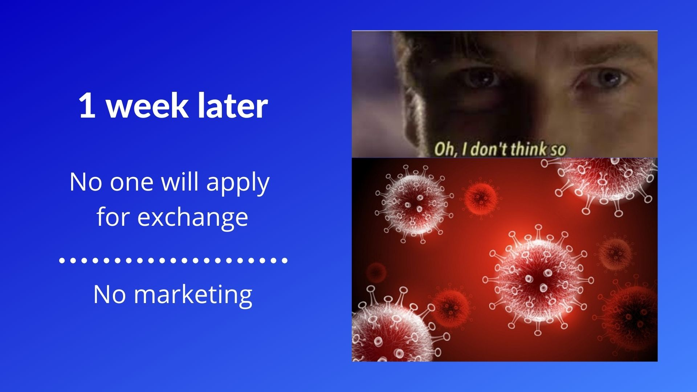

### **And then exactly one week after I got into process lockdown happened. Doing exchanges and promotion was not possible for a long time and we could not even meet in the office.**
-------------

### **In April I've got to designing and promoting my first event in AIESEC and the first ever online event done by AIESEC in Czech Republic. I came up with a name and visuals and we had about 50 participants which is not big number but it is more then AIESEC Prague had before on similar events that were held offline.**
-------------

### **Second Travelink I did one month later and I redesigned the visuals to corespond with the new "with aiesec." campaign and made the new logo. This logo was later that year approved by national committee and is now being used across all local committees in Cyech Republic that are doing this event.**
-------------
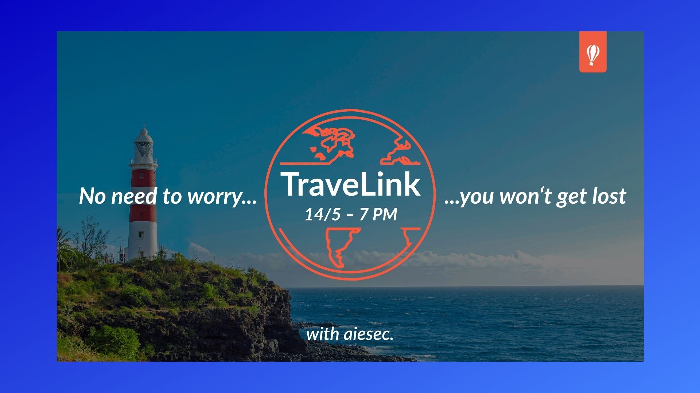

### **This is another one of the posts that I created for the Facebook event page.**
-------------

### **At this time I was still studying Graphic and media design at University of creative communication in Prague (VŠKK). I was in my 4th term and working with a team of people on school projects. Why am I talking about this? I had terrible experience with team work in this group. We started as team of 7 people and at the end of the term there was only 3 of us left. In AIESEC you are supposed to develop and apply to higher position such as team leader or manager and because of this experience I was not sure if I want to do it.**
--------------
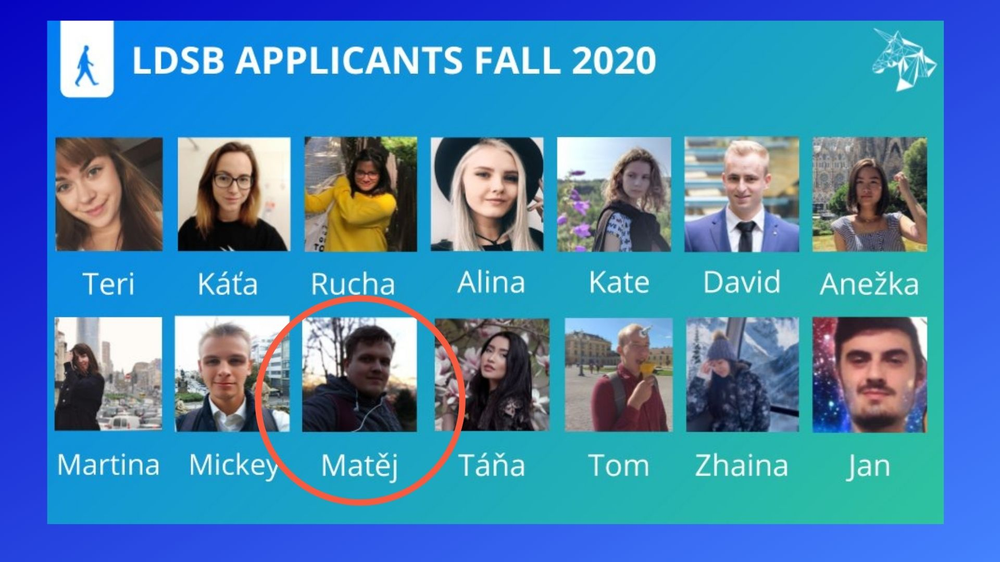

### **But in the end I decided to take this opportunity because I had met bunch of amazing people and friends not only from Czech Republic but other parts of world and I wanted to continue even if the situation with COVID-19 was still uncertain.**
--------------

### **I passed the election process and was elected as member of leadership body of AIESEC Prague.**
--------------
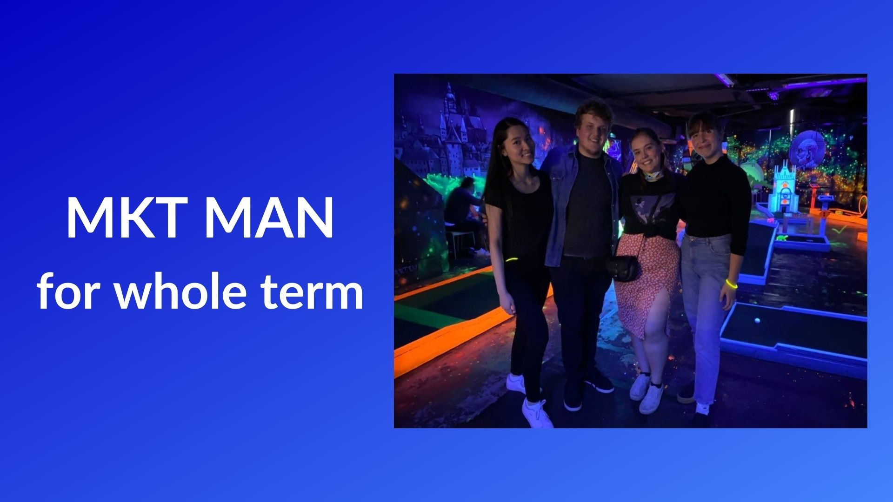

### **My new position was marketing manager for Fall 2020 period and I was working with two other marketing managers and under our vice president of marketing functional area Chiara Judt.**
--------------
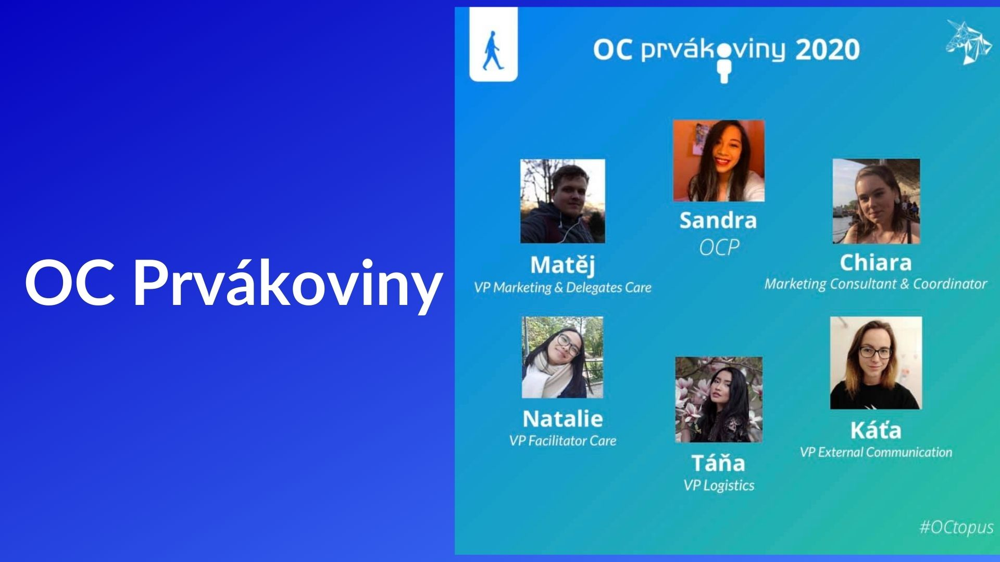

### **In Septeber we are having new recruitment process to get new members to our committee. One of activities that we are doing every year to get applications is organizing "Prvákoviny". That is event held at University of Economics in Prague for freshmen. I applied to organization committee for this event and was elected as person responsible for marketing of this event. It was extra activity to my new position.**
--------------
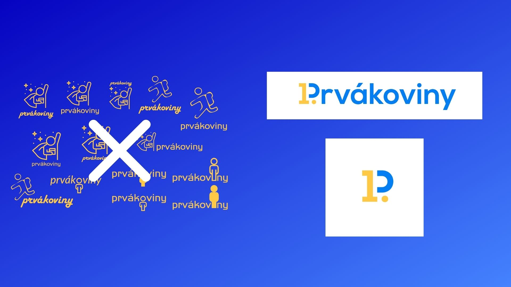

### **I created new logo for and visual style for year 2020**
--------------

### **We chose the date of event (22nd-24th of September). But we started with promotion of the event already in second half of August. Due to restictions it was also the first year that we had this event streamed online via Zoom.**
--------------
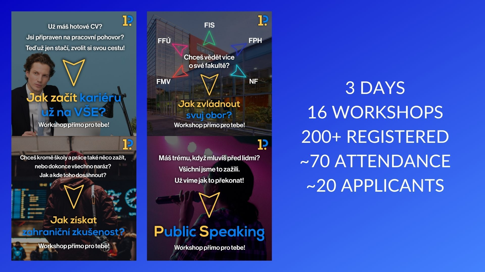

### **I created 20+ different post and I myself managed to get 200+ registered people on the event. We had araund 70 attendees on all 3 days. We also managed to get about 20 applicants to our committee which was 30% of planed applications. Overall the event was very successful.**
--------------
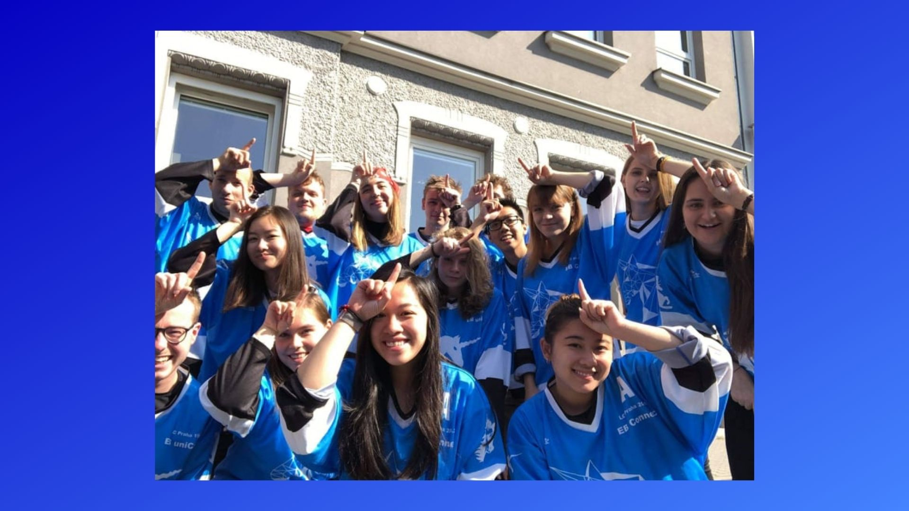

### **At the and of September after this event and right before approving new members that will join AIESEC in Prague we had small conference to create our plan for the new term.**
--------------
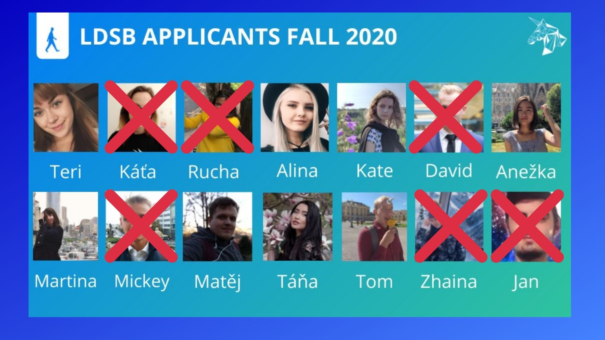

### **However due to different reasons connected with COVID-19 restrictions or other personal issues few of people that were elected left the organization. But those of us stayed kept believing that the situation will get better and we will be able to return to do exchanges again.**
---------------
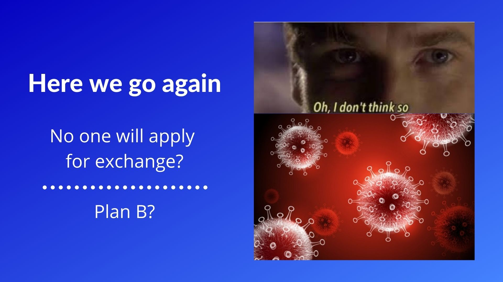

### **Well, second wave of COVID-19 hit the Czech Republic even earlier than other countries and we were back at the bottom. But we knew that we can wait anymore because eventhough we are not profit organization we need to be sustainable and pay for our offices for example and we needed Plan B.**
---------------

### **The Plan B that our elected board of the committee came up with was corporate events abnd I was picked to join this initiative and take care of marketing and design of this new project. We came up with name Headstart and it is going to be project in which we cooperate with companies or start-ups on online workshops.**
--------------

### **Right now we are still in the preparation process so I am working on promo materials.**
--------------
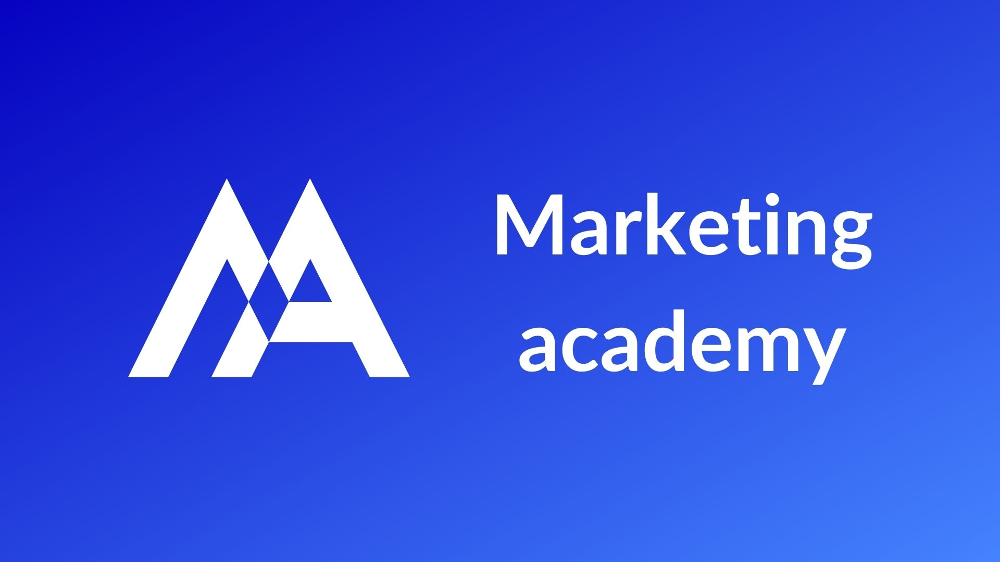

### **In December 2020 I was chosen to organize marketing and graphic design education spaces for the members of AIESEC because I was the only member at this time that has graphic design background. I already had two "Marketing academies" and it was useful experience for me.**
--------------
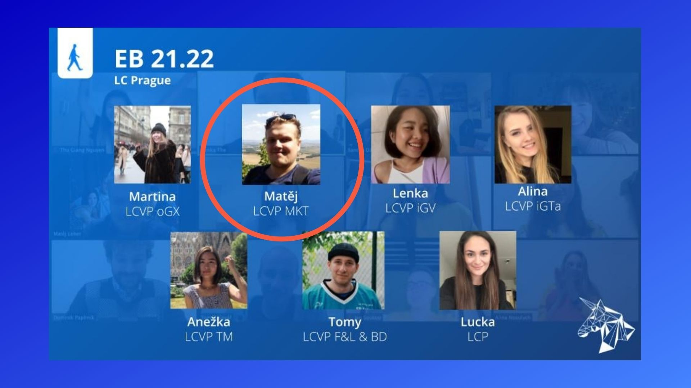

### **Since I enjoyed myself and developed many useful skills during the term I decided to apply for a higher position again. I was elected as member of elected board and vice president of marketing for 21.22 (from February 2021 till January 2022). That means that it will be the first time for me when I will have responsibility of being a leader of people and main person responsible for planning whole year of all marketing acitivities of our local committee.**
--------------

### **Now I am part of very good team of people and I am glad that I've taken this opportunity and we will do our best to lead or committee and make sure that our organization survives for next generations of AIESECers.**
---------------

### **But well, situation is still not getting better and COVID-19 will be here with us atleast few next months. But this presentation was about me and year 2020. My take away from these crazy times is to not get let down by the things that I can change. Ironically this might be a year in which I've met most of new people in my life and even though I have met them personally less than 10 times I still made lot of memories and connections with them. Also I feel like I improved and developed and I don't feel like this year was a waste.**
